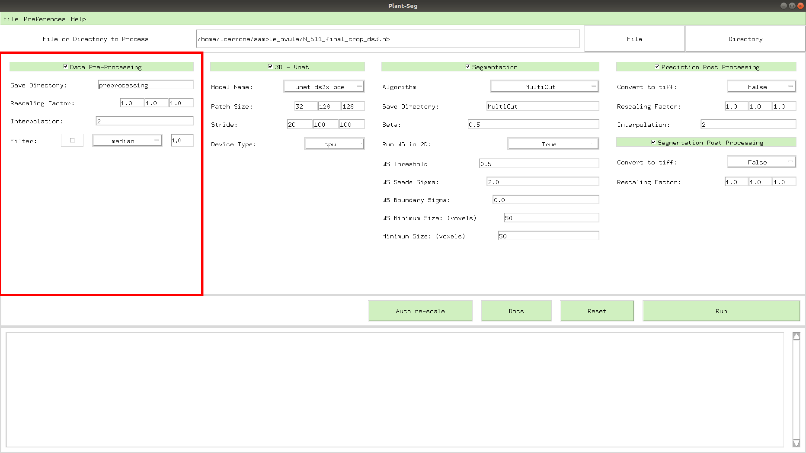

# Data Processing 
**PlantSeg** includes basic utilities for data pre-processing and post-processing. 

## Pre-Processing


The input for this widget can be either a "raw" image or "prediction" image. 
Input format allowed are tiff and h5 while output is always h5.  
* The **Save Directory** entry can be used to define output directory.  
* The most important setting is the **Rescaling**. It is very important to rescale the image to 
 match the resolution of the data used for training the Neural Network.
This operation can be done automatically by clicking in the gui on **Guided**.  
Be careful to use this function only in case of data considerably different from 
the reference resolution.
```
As and example:
  - if your data has the voxel size of 0.3 x 0.1 x 0.1 (zxy).
  - and the networks was trained on 0.3 x 0.2 x 0.2 data (reference resolution).

The required voxel size can be obtained by computing the ratio between your data and the
reference at train. In the example the rescaling factor = 1 x 2 x 2. 
```

* The **Interpolation** field control the interpolation type (0 for nearest neighbors, 1 for linear spline, 
2 for quadratic).

* The last field defines a **Filter** operation. Implemented there are:
    1. **Gaussian** Filtering: The parameters is float and define the sigma value for the gaussian smoothing. 
The higher the wider is filtering kernel.
    2. **Median** Filtering: Apply median operation convolutionally over the image.
 The kernel is a sphere of size defined in the parameter field.

## Post-Processing


A post processing widget can be applied after the **CNN-Predictions** and the **Segmentation**.
Two type of operations can be performed:
 * Converting output to tiff file (default is h5).  
 
 * Casting the **CNN-Predictions** output to *data_uint8* drastically reduce the memory foot print of the output 
 file.  
 
Additionally, the post processing will scale back your outputs to the original voxels resolutions. 