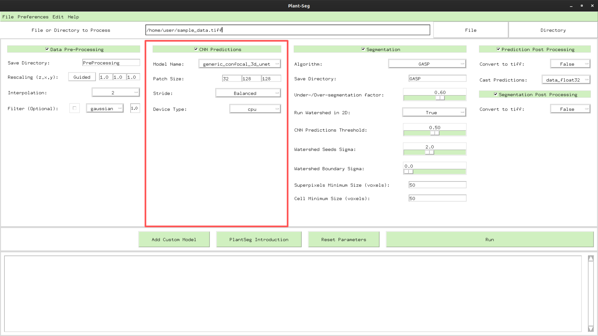

# CNN Predictions

The CNN predictions widget process the stacks at hand with a Convolutional Neural Network. The output is 
a boundary classification image, where every voxel gets a value between 0 (not a cell boundary) and 1 (cell boundary).

The input image can be a raw stack "tiff"/"h5" or the output of the PreProcessing widget. 

* The **Model Name** menu shows all available models. There are two main basic models available  
    1. **Generic confocal**, this a generic model for all confocal dataset.  
    Some examples:
    
    2. **Generic lightsheet** this a generic model for all lightsheet dataset.  
     Some examples:
    
* Due to memory constrains, usually a complete stacks does not fit the GPUs memory, 
 therefore the **Patch size** can be used to optimize the performance of the pipeline. 
 Usually a bigger patches cost more memory but can give a slight improvement in performance.
 For 2D segmentation the **Patch size** relative to the z axis has to be set to 1.
 
* To minimize the boundary effect due to the sliding windows patching we can use different **stride**:
    1. Accurate: corresponding to a stride 50% of the patch size (yield best predictions/segmentation accuracy)
    2. Balanced: corresponding to a stride 75% of the patch size
    3. Draft: corresponding to a stride 95% of the patch size (yield fastest runtime)
    
* The **Device type** menu can be used to enable or not gpu acceleration. The networks predictions are 
greatly accelerated by CUDA on Nvidia GPUs, at the moment we don't support other GPUs manufacturers.
