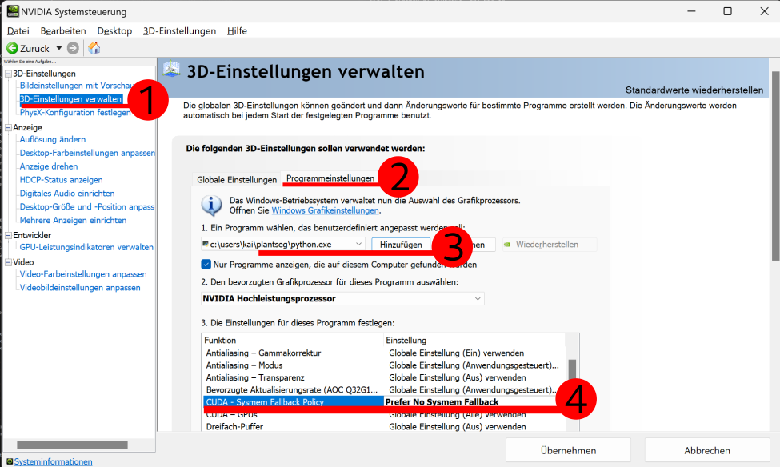

# Known Issues

## Boundary prediction not starting

!!! tip "Relevant for:"
    * Windows
    * nvidia GPU

On Windows using a nvidia GPUs PanSeg might appear stuck running the prediction.
If this error occurs, check the GPU memory in the task manager, it is probably full.

GPUs can use the system memory after running out of memory
on the GPU itself. This prevents crashes and errors, but makes all operations
very slow.  
In PlanSeg, this "feature" prevents us from finding optimal patch and batch
sizes for your GPU.  
Here is how you can fix the issue:

#### A) Quick and dirty fix: Set patch and batch size manually

In `Segmentation`, `Boundary Prediction`, click on `Show advanced parameters`.
Then check the box `Manual Patch Size` and enter your patch size (min 64x64 in x,y dimension).
Set `Batch size` to `One (low VRAM usage)`.

#### B) Proper fix: Disable memory off-loading

Open your nvidia control panel. Navigate to `3D-Settings`(1), `Program specific` (not global)(2).
Click on `add` and choose Python, afterwards it should display the path to the python
executable **in you PanSeg installation**(3).

Scroll to `CUDA - Sysmem Fallback Policy` and change that to `Prefer No Sysmem Fallback`(4).

