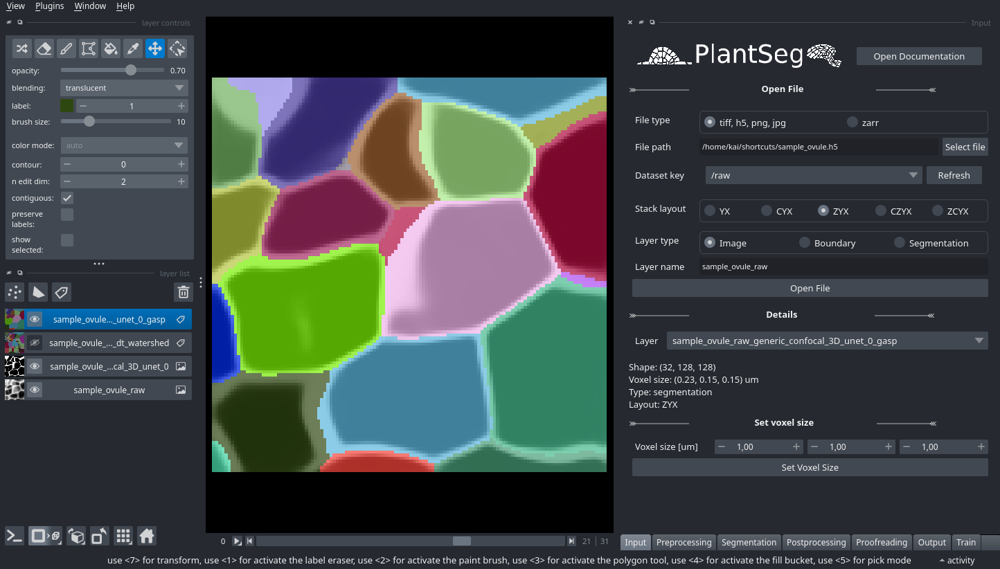

# PlantSeg Interactive - Napari

Interactively apply operations to your images and run the segmentation
pipeline using the GUI of PlantSeg.
PlantSeg uses napari as its front-end.

Start PlantSeg according to your chosen [installation method](../getting_started/installation.md).
From the terminal, you can start PlantSeg in the GUI mode with:

```bash
plantseg --napari
or
plantseg -n
```



## Parts of the GUI

### Top left: Settings

* Change your **tool** (pan, brush, boxselect, ...)
* Change **look of image** (opacity, label colors,..)
* Change **tool settings** (brush color & size, select shape)

### Bottom left: Layer selection

Your loaded layers get displayed here. Toggle their visibility with the eye icon.
Below, you can switch to a **grid view** or a **3D view** with the respective icons.

### Right: PlantSeg

This is the main interface of PlantSeg.
On the bottom you can switch through the different sections of PlantSeg.
